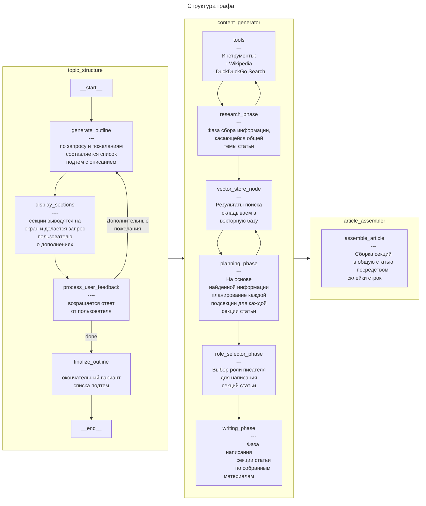

```mermaid
---
title: Структура графа
---
%%{init: {'loglevel': 'debug', 'theme': 'forest}}%%
graph LR
    subgraph topic_structure
        direction TB
        id1[__start__] --> id2["generate_outline"
                                ---
                                по запросу и пожеланиям
                                составляется список
                                подтем с описанием]
        id2 --> id3[display_sections
                    ----
                    секции выводятся на
                    экран и делается запрос
                    пользователю
                    о дополнениях]

        id3 --> id4[process_user_feedback
                    ----
                    возращается ответ
                    от пользователя]

        id4 -->|Дополнительные
                пожелания| id2

        id4 -->|done| id5[finalize_outline
                    ----
                    окончательный вариант
                     списка подтем]
        id5 --> id6[__end__]
    end
    subgraph content_generator
        direction TB
        id7[tools
            ---
            Инструменты:
            - Wikipedia
            - DuckDuckGo Search] --> id8[research_phase
                                        ---
                                        Фаза сбора информации,
                                        касающейся общей
                                        темы статьи]
        id8 --> id7
        id8 --> id9[vector_store_node
                    ---
                    Результаты поиска
                    складываем в
                    векторную базу]
        id9 --> id10[planning_phase
                    ---
                    На основе
                    найденной информации
                    планирование каждой
                    подсекции для каждой
                    секции статьи]
        id10 --> id9
        id10 --> id11[role_selector_phase
                    ---
                    Выбор роли писателя
                    для написания
                    секций статьи]
        id11 --> id12[writing_phase
                    ---
                    Фаза написания
                    секции статьи
                    по собранным материалам]

    end
    subgraph article_assembler
        direction TB
        id13[assemble_article
            ---
            Сборка секций
            в общую статью
            посредством склейки строк]
    end
    topic_structure --> content_generator
    content_generator --> article_assembler
```
